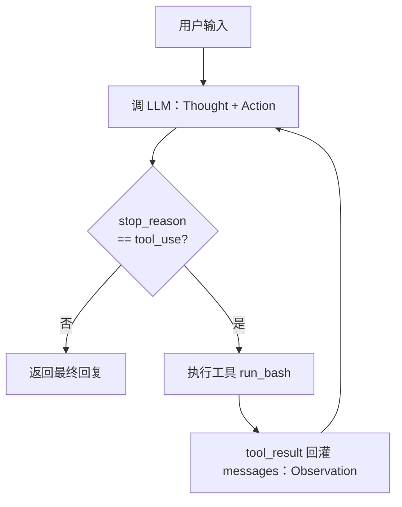
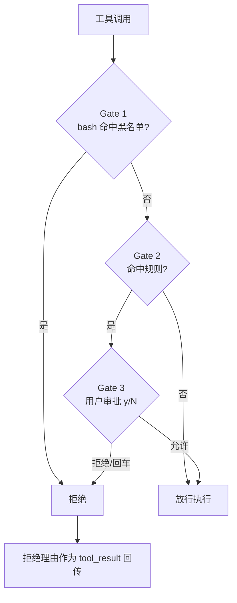
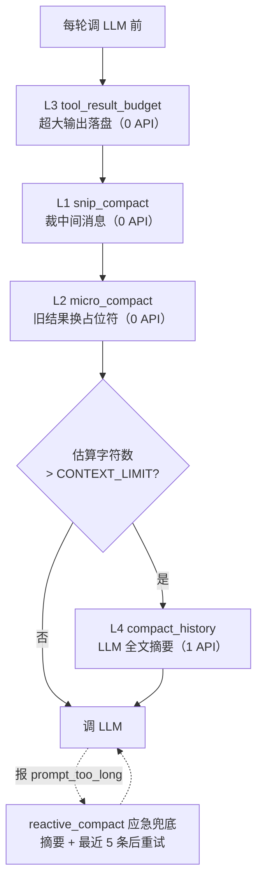
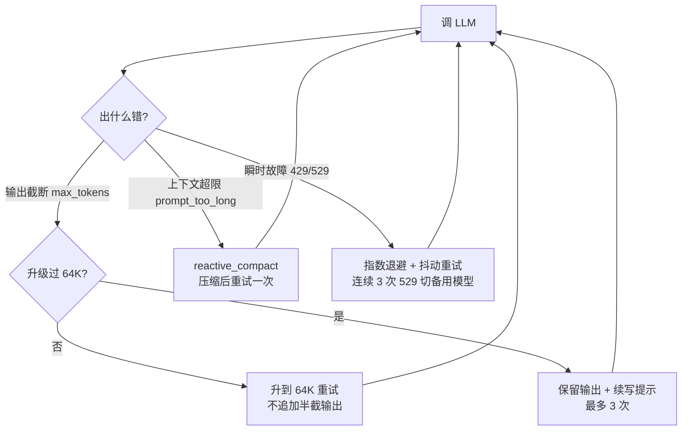
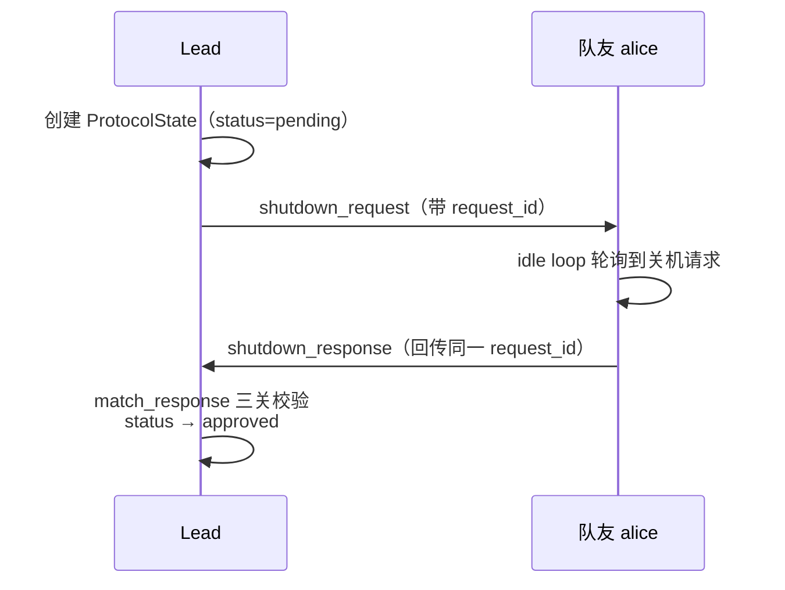
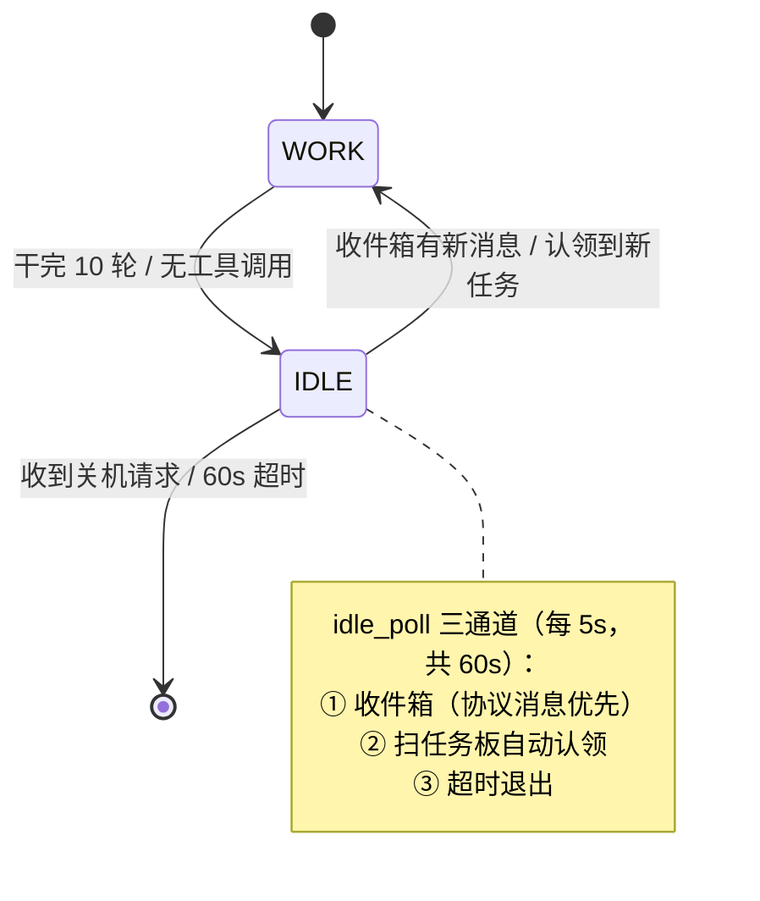
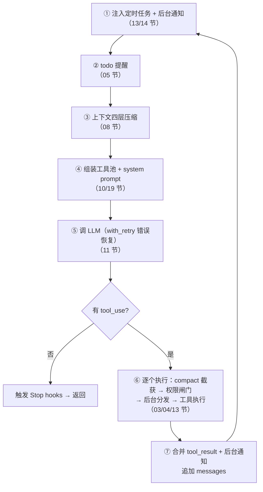

# Claude Code 实现原理拆解：一个 Agent Harness 的 20 层结构

> 日常使用 Claude Code 或其他 AI 编程工具写代码时，很容易对它内部怎么运转产生兴趣——为什么能连续跑几十轮不跑偏、上下文满了之后发生了什么、多个 Agent 并行改代码为什么不互相覆盖。为此我花了一段时间把这类编程 Agent 的实现机制梳理了一遍并记录下来，方便日常工作中使用和搭建 Agent。
>
> 本文基于开源项目 [shareAI-lab/learn-claude-code](https://github.com/shareAI-lab/learn-claude-code) 整理，想跑代码、看完整实现可直接去仓库。AI 迭代很快，仓库后续更新可能与本文对不上。
>
> 全文按 20 个机制层次组织，每一节的结构是：**这一层解决什么问题 → 怎么实现 → 要点与取舍**。
>
> 说明：（1）文中代码不是 Claude Code 源码，而是为讲清原理写的**精简 Python**：只保留能说明机制的骨架行，错误分支、参数校验、锁维护这类样板逻辑一律用注释交代。目标是让你**扫一眼就知道这层挂在哪里、做了什么**，不需要逐行读。真实实现与最小实现的差距集中在文末一张表里。（2）借助 AI 对文章表述进行了润色。

---

## 00 先对齐一个前提：Agent 的智能不在编排代码里

**模型的感知、推理、决策能力来自训练本身（预训练、监督微调 SFT、强化学习），不来自外部编排代码。** 外面这一层叫 **harness**（载具），职责是给模型一套可操作的环境。

```
Harness = Tools + Knowledge + Observation + Action Interfaces + Permissions

    Tools:        文件读写、Shell、网络、数据库、浏览器
    Knowledge:    产品文档、领域资料、API 规范、风格指南
    Observation:  git diff、错误日志、命令输出
    Action:       CLI 命令、API 调用、UI 交互
    Permissions:  沙箱隔离、审批流程、信任边界
```

**Agent = Model + Harness。**

模型做决策，harness 负责执行；模型做推理，harness 负责喂上下文。

这个区分有很实际的意义：**它决定了出问题时该往哪儿改**。Agent 干活跑偏，通常不是"提示词不够长"，而是 harness 缺了某一层能力——它看不到该看的信息（上下文管理缺失）、没有该有的工具（能力边界缺失）、或者没有把目标持久化下来（任务系统缺失）。

反过来说，用 if-else 分支、节点图、硬编码路由去"模拟"智能的那类工作流编排，本质是把符号规则系统重新包装一遍，随着分支增长会迅速变得不可维护，而且不具备泛化能力。Claude Code 的做法恰恰相反：**它没有替模型做判断，只是把工具、知识、上下文和权限边界准备好，然后让开，让它充分发挥自己的实力。**

Claude Code 拆到本质，就是这几块：

```
Claude Code = 一个 agent loop
            + 工具 (bash, read, write, edit, glob, ...)
            + 按需 skill 加载
            + 上下文压缩
            + 子 agent 派生
            + 带依赖图的任务系统
            + 异步邮箱的团队协调
            + worktree 隔离的并行执行
            + 权限治理
```

这就是全部架构。下面 20 节，逐层拆开。

---

## 整体结构

20 个机制按能力递进分成 6 个阶段，每一层只加一件事，主循环本身几乎不动：

| 阶段 | 机制 | 加了什么 |
|---|---|---|
| 一、能动手 | 01 Agent Loop / 02 Tool Use / 03 Permission / 04 Hooks | 循环、工具分发、权限闸门、扩展插口 |
| 二、能做复杂任务 | 05 TodoWrite / 06 Subagent / 07 Skill Loading / 08 Context Compact | 先计划、上下文隔离、知识按需加载、压缩腾地方 |
| 三、能记住和恢复 | 09 Memory / 10 System Prompt / 11 Error Recovery | 跨会话记忆、运行时组装提示词、错误重试 |
| 四、能长期运行 | 12 Task System / 13 Background Tasks / 14 Cron Scheduler | 持久化任务图、后台线程、定时触发 |
| 五、能协作 | 15 Agent Teams / 16 Team Protocols / 17 Autonomous Agents / 18 Worktree Isolation | 队友+邮箱、请求-响应协议、自主认领、目录隔离 |
| 六、能扩展并合体 | 19 MCP Plugin / 20 综合架构 | 外部工具接入、全机制归一个循环 |

### 代码约定

全文代码片段共用几个符号，后面不再重复解释：

| 符号 | 含义 |
|---|---|
| `client` | Anthropic 官方 SDK 客户端，`client.messages.create(...)` 就是一次模型调用 |
| `MODEL` / `SYSTEM` | 模型名、system prompt |
| `WORKDIR` | Agent 的工作目录，也是文件访问的沙箱边界 |
| `messages` | 对话历史，`{role, content}` 列表 |
| `block` | 模型返回的单个内容块，`block.name` / `block.input` / `block.id` 分别是内容块名、参数、调用 ID |

函数名前的注释就是它的实现说明。凡是用 `# 函数名(参数): 职责` 形式给出的，意思是“这个函数体对当前主线没信息量，知道它干什么就够了”——不会出现没交代过的调用。

---

## 01 Agent Loop：ReAct 设计框架

### 问题

LLM 能输出一条 shell 命令，但它不会自己执行，也看不到执行结果。因此需要一个"帮它跑、并把结果喂回去"的中间层。

### 实现

一个 `while True`，主要做三件事：发消息、判断要不要调工具、执行并回传。注意这里工具集只有一个 bash 工具。

本质就是 ReAct 设计框架 = Thought（思考/推理）+ Action（行动）+ Observation（观察）。对应到下面的代码：模型输出 = Thought + Action，`tool_result` 回传 = Observation。




```python
def agent_loop(messages: list):
    while True:
        response = client.messages.create(
            model=MODEL, system=SYSTEM, messages=messages,
            tools=TOOLS, max_tokens=8000,
        )
        messages.append({"role": "assistant", "content": response.content})

        if response.stop_reason != "tool_use":
            return

        results = []
        for block in response.content:
            if block.type == "tool_use":
                output = run_bash(block.input["command"])  # 跑 shell 命令，带超时与输出截断
                results.append({
                    "type": "tool_result",
                    "tool_use_id": block.id,
                    "content": output,
                })
        messages.append({"role": "user", "content": results})
```

三个主要的数据结构：

- `messages`：对话历史，`{role, content}` 列表，是 Agent 的当前上下文
- `TOOLS`：工具定义数组，每项含 `name` / `description` / `input_schema`（JSON Schema）
- `response.content`：内容块 List，每块有 `type`（`text` 或 `tool_use`）

**退出条件由模型决定，不由代码决定**：`stop_reason != "tool_use"` 就返回。代码从不判断"任务做完了没有"，那是模型的职责。

工具结果以 `role: "user"` 追加回去，通过 `tool_use_id` 与请求配对——这是 Anthropic API 的约定，不是随意设计。

### 要点与取舍

- **`stop_reason` 在流式响应下不完全可靠**。Claude Code 不直接看它，而是用 `needsFollowUp` 标志：只要检测到 `tool_use` 块就置 true。
- **单工具会带来不小代价**。只有 bash 工具时，模型读文件要拼 `cat file.py`，写文件要拼 heredoc（shell 里把多行文本当输入的写法，如 `cat > f <<EOF ... EOF`），既费 token 又容易转义出错。这是第 2 节要解决的问题。
- **防止 Agent 执行危险操作**。最小实现里的 `run_bash` 有一个简单黑名单（`rm -rf /`、`sudo` 等）和超时截断，但那不是安全机制，只是防手滑。具体的权限控制在第 3 节。

---

## 02 Tool Use："加工具"不用"改循环"

### 问题

第 1 节把 `run_bash` 硬编码在循环里。加第二个工具就要在循环里写 if/elif，加到第十个工具循环就没法看了。

### 实现

**Dispatch Map**：工具定义和处理函数分成两张表，循环只查表。

```python
TOOLS = [
    {"name": "bash", "description": "Run a shell command.",
     "input_schema": {"type": "object",
                      "properties": {"command": {"type": "string"}},
                      "required": ["command"]}},
    # 下面四个工具的 schema 结构同上，只是参数不同，此处省略
    {"name": "read_file", ...},
    {"name": "write_file", ...},
    {"name": "edit_file", ...},
    {"name": "glob", ...},
]

# 五个 handler 都是十几行的薄封装：run_read 读文件（可限行数）、run_write 写文件、
# run_edit 精确替换一处文本、run_glob 按通配符列文件；路径统一经 safe_path 校验
TOOL_HANDLERS = {
    "bash": run_bash, "read_file": run_read, "write_file": run_write,
    "edit_file": run_edit, "glob": run_glob,
}
```

循环里的改动只有一行：

```python
# 之前: output = run_bash(block.input["command"])
handler = TOOL_HANDLERS.get(block.name)
output = handler(**block.input) if handler else f"Unknown: {block.name}"
```

从此加工具 = 加一条 schema + 加一行映射，`agent_loop` 永久不动。

同时引入了第一道安全边界 `safe_path(p)`：把传入路径拼到 `WORKDIR` 下、调 `resolve()` 展开 `..` 和符号链接，再确认结果仍在 `WORKDIR` 内，否则报错。所有文件类工具的路径都要过它。没有它，模型（或者一段被注入的提示词）可以用 `../../../../etc/shadow` 走出去。

### 要点与取舍

- **`input_schema` 是可靠性的来源**。让模型产出结构化参数，比让它产出一行需要正则解析的字符串稳定得多。工具描述写清楚，模型的调用准确率会明显不同。
- **多工具调用的执行顺序**：最小实现按 `response.content` 的原始顺序逐个执行。Claude Code 会按连续块分批，batch 内并发安全的工具并行跑，batch 间严格串行——因为 `read_file` 之间无所谓顺序，但 `write_file` 和后续的 `read_file` 顺序反了结果就错了。这需要一个并发安全判定加分区算法。

---

## 03 Permission：三道闸门，默认拒绝

### 问题

文件工具被 `safe_path` 管住了，但 bash 仍然不受限制。而且"要不要执行这条命令"是**策略问题**，不该写在 `run_bash` 里面——那会让工具函数同时承担"能不能做"和"该不该做"两件事，变得臃肿复杂。

### 实现

把权限从工具里抽出来，做成独立的三级管线：



```python
# Gate 1 的硬黑名单：bash 命令含任一字串就无条件拒绝，不问用户
DENY_LIST = ["rm -rf /", "sudo", "shutdown", "reboot", "mkfs", "dd if=", "> /dev/sda"]

# Gate 2 的规则表。每条 = {tools: 适用工具, check: 命中判定, message: 给用户看的理由}
#   ① write_file / edit_file：path resolve 后落在 WORKDIR 外 → "Writing outside workspace"
#   ② bash：命令含 "rm " / "> /etc/" / "chmod 777" → "Potentially destructive command"
PERMISSION_RULES = [...]

# check_deny_list(command) / check_rules(tool, args): 几行遍历，命中返回原因字符串否则 None
# ask_user(tool, args, reason): 终端打印警告并读一行输入，返回 "allow" / "deny"
def check_permission(block) -> bool:
    if block.name == "bash" and check_deny_list(block.input.get("command", "")):
        return False                                      # Gate 1: 硬黑名单
    reason = check_rules(block.name, block.input)          # Gate 2: 规则匹配
    if reason:                                             # 命中才问用户
        return ask_user(block.name, block.input, reason) == "allow"   # Gate 3: 审批
    return True
```

循环里加三行，被拒绝的调用不是抛异常，而是**把拒绝理由当成工具结果回传**：

```python
if not check_permission(block):
    results.append({"type": "tool_result", "tool_use_id": block.id,
                    "content": "Permission denied."})
    continue
```

这一点很重要：模型看到"权限被拒"这条结果后，会自己换一条路走。如果直接抛异常中断循环，Agent 就中断了。

### 要点与取舍

- **Gate 3 默认拒绝**。`ask_user` 只有输入 `y`/`yes` 才放行，回车即拒绝。审批交互一定要设计成 fail-closed（判断不了或无人应答时一律拒绝）。
- **字符串黑名单不是安全机制**。命令变体、shell 展开、base64 解码、拿 `$IFS`（shell 的内部分隔符变量）拼接都能绕过。它挡的是"模型手滑"，不是"有人故意攻击"。真要防后者得使用命令行语法树（AST）解析 + 沙箱。
- Claude Code 的实际复杂度在另一个量级：4 种权限决策结果（allow/deny/ask/passthrough）、8 个规则来源（用户设置、项目设置、本地设置、feature flag、企业策略、CLI 参数、内联命令、会话授权）、自动审批分类器，以及子 Agent 的权限请求向父 Agent 冒泡。

---

## 04 Hooks：把扩展点从循环里搬出去

### 问题

第 3 节为了加权限，改了循环。接下来要加日志、加审计、加"改完文件自动 git add"，每次都得再改一遍循环。当前扩展性比较差。

### 实现

一个事件注册表，14 行：

```python
HOOKS = {"UserPromptSubmit": [], "PreToolUse": [], "PostToolUse": [], "Stop": []}

def register_hook(event: str, callback):
    HOOKS[event].append(callback)

def trigger_hooks(event: str, *args):
    for callback in HOOKS[event]:
        result = callback(*args)
        if result is not None:
            return result        # 短路：非 None = 拦截
    return None
```

简单约定：**回调返回 `None` 表示放行，返回非 `None` 表示拦截**，并且第一个非 `None` 就短路。

四个事件的语义：

| 事件 | 时机 | 典型用途 |
|---|---|---|
| `UserPromptSubmit` | 用户输入后、进 LLM 前 | 注入上下文、输入校验 |
| `PreToolUse` | 工具执行前 | 权限检查、日志 |
| `PostToolUse` | 工具执行后 | 副作用（自动 git add）、大输出告警 |
| `Stop` | 循环即将退出 | 收尾统计、**强制续跑** |

第 3 节的权限逻辑原封不动搬进一个回调，权限从此只是众多 `PreToolUse` hook 中的一个：

```python
register_hook("UserPromptSubmit", context_inject_hook)  # 补当前目录、分支等环境信息
register_hook("PreToolUse", permission_hook)            # 第 3 节的 check_permission 原样搬进来
register_hook("PreToolUse", log_hook)                   # 打印工具名与参数，返回 None 不拦
register_hook("PostToolUse", large_output_hook)         # 输出过大时告警，返回 None 不拦
register_hook("Stop", summary_hook)                     # 退出前统计工具调用次数
```

`Stop` hook 有个巧妙用法——它返回非 `None` 时，循环不退出，而是把返回值当成一条用户消息注入再 `continue`：

```python
if response.stop_reason != "tool_use":
    force = trigger_hooks("Stop", messages)
    if force:
        messages.append({"role": "user", "content": force})
        continue
    return
```

这就是"自纠"能力的实现方式：Agent 说"我做完了"，Stop hook 检查发现测试没跑，注入一句"请先跑测试"，Agent 就继续干活了。

### 要点与取舍

Claude Code 有 27 个 hook 事件、14 字段的 hook 结果对象，还有一个 `stopHookActive` 标志防止 Stop hook 无限续跑（否则 hook 和模型可以拉扯到 token 耗尽）。最小实现只保留 4 个常见事件。

---

## 05 TodoWrite：给 Agent 一块外挂工作记忆

### 问题

复杂任务做到一半，Agent 忘了最初的目标。原因在于：工具结果不断填满上下文，系统提示和最初目标在注意力机制里的权重就越来越低。

### 实现

一个**不干实事**的工具 `todo_write` ——它不读文件、不跑命令，只把 todo 计划写/更新下来：

```python
CURRENT_TODOS: list[dict] = []     # 进程内存，退出即丢

def run_todo_write(todos: list) -> str:
    # 逐项校验：content / status 字段齐全，且 status ∈ {pending, in_progress, completed}，
    # 不合法就返回 "Error: todos[i] ..." 让模型自己改——校验失败也是一条正常的工具结果
    CURRENT_TODOS[:] = todos
    return f"Updated {len(todos)} tasks"
```

再配一个 nag 机制（周期性提醒）：连续 3 轮没调用 `todo_write` 工具，就往消息流里塞一条提醒。

```python
rounds_since_todo = 0              # 计数器：连续多少轮没更新 todo

# 挂进第 1 节的循环，只动两处：
#   ① 每轮开头：rounds_since_todo >= 3 就往 messages 里塞一条
#      {"role": "user", "content": "<reminder>Update your todos.</reminder>"}，然后归零
#   ② 每轮执行工具时：调到 todo_write 就归零，否则轮末 +1
```

### 要点与取舍

- **软引导 + 硬提醒的两层结构**：system prompt 说"请先规划"是软引导，模型可能不听；nag 是硬提醒，每 3 轮必到。两者互补，缺一个会影响效果。
- **提醒不是报错**。它不拒绝执行、不打断循环，只是在上下文里放一条信息让模型自己看到。这类"非破坏性纠偏"在 Agent 工程里很常用——同样的手法后面还会用于后台任务通知（第 13 节）、定时任务注入（第 14 节）、收件箱注入（第 15 节）。
- 最小实现的 TODO 存在进程内存里，退出即丢。Claude Code 是内存版 TodoWrite 和落盘版 Task System 并存，各管一层（见第 12 节）。

---

## 06 Subagent：上下文隔离，但权限不隔离

### 问题

"分析这 30 个文件里的重复逻辑"——如果在主对话里做，30 个文件的全文会留在 `messages` 里，这些中间过程占着上下文位置，让 Agent 越来越"健忘"，导致它都记不住最初的问题是什么了。但主 Agent 真正需要的其实只是一句结论。

### 实现

主 Agent 多了一个 task 工具，可以派生一个带**干净 `messages`** 的独立循环（subAgent），跑完只把最后的文本结论带回来，中间过程全部丢弃：

```python
# 子 Agent 专用的三个常量：
#   SUB_SYSTEM   独立的 system prompt，要求"干完直接给结论，不要再往下委派"
#   SUB_TOOLS    只有 5 个基础工具（bash / read / write / edit / glob），没有 task
#   SUB_HANDLERS SUB_TOOLS 对应的 handler 表，结构同第 2 节的 TOOL_HANDLERS
def spawn_subagent(description: str) -> str:
    messages = [{"role": "user", "content": description}]   # ① 干净上下文，不继承主对话

    # ② 跑的还是第 1 节那个循环，只换三样东西：SUB_SYSTEM / SUB_TOOLS / SUB_HANDLERS。
    #    工具执行照样过 PreToolUse 与 PostToolUse hook；最多 30 轮兜底
    run_tool_loop(messages, SUB_SYSTEM, SUB_TOOLS, SUB_HANDLERS, max_rounds=30)

    # ③ 只回传结论：extract_text 从最后一条消息拼纯文本，忽略 tool_use 块。
    #    为空则向前回溯找最后一条有文本的 assistant 消息，仍没有就返回明确的失败信息
    return extract_text(messages[-1]["content"])
```

三个主要的设计点：

1. **禁止递归靠"没有 task 工具"，不靠判断层数**。`SUB_TOOLS` 里根本没有 `task` 工具，模型看不到它，自然调不出来。这是硬约束，比"检查 depth < 3"更可靠。
2. **上下文隔离 ≠ 权限隔离**。子 Agent 的每次工具调用同样走 `PreToolUse` hook。隔离的是"看到什么"，不是"能干什么"。
3. **返回值是摘要，不是历史**。如果回传子 Agent 的 `messages` 会丢失隔离的意义。

### 要点与取舍

30 轮上限是兜底：子 Agent 卡在某个循环里时，最坏情况也就烧掉 30 次调用。返回值为空时会向前回溯找最后一条有文本的 assistant 消息，仍然没有就返回明确的失败信息——不要让上层拿到空字符串。

---

## 07 Skill Loading：目录常驻，内容按需

### 问题

有 10 份领域文档要给 Agent 用。如果全塞进 system prompt，每轮请求都要消耗这些 token；不塞的话，Agent 根本不知道这些文档存在。

### 实现

两级加载。第一级把**目录**（名称 + 一行描述）注入 system prompt，第二级由 Agent 自己调 load_skill 工具拉**全文**。每个 skill 是一个 `SKILL.md` 文件，文件头用 `---` 包裹一段 YAML 元数据（frontmatter）写 `name` 和 `description`，下面是正文。

```python
SKILLS_DIR = WORKDIR / "skills"        # 每个子目录一个 skill
SKILL_REGISTRY: dict[str, dict] = {}   # name -> {name, description, content}

# _scan_skills(): 启动时遍历 skills/*/SKILL.md，用 _parse_frontmatter 拆出 (meta, 正文)，
#   按 name（缺失则用目录名）写入 SKILL_REGISTRY；description 缺失则取正文首行
# list_skills(): 把 SKILL_REGISTRY 拼成 "- **name**: description" 的多行文本

def build_system() -> str:                     # Layer 1：只注入目录到 System Prompt
    return (f"You are a coding agent at {WORKDIR}. "
            f"Skills available:\n{list_skills()}\n"
            "Use load_skill to get full details when needed.")

def load_skill(name: str) -> str:              # Layer 2：按需拉全文
    """只接受 name，通过 SKILL_REGISTRY 查表——name 从来不是路径，无路径遍历风险。"""
    skill = SKILL_REGISTRY.get(name)
    return skill["content"] if skill else f"Skill not found: {name}"
```

成本最直观的对比：

| 层级 | 内容 | 量级 | 频率 |
|---|---|---|---|
| Layer 1 | 名称 + 一行描述 | ~100 tokens/skill | 每轮都带 |
| Layer 2 | SKILL.md 全文 | ~2000 tokens/skill | 用到才拉 |

### 要点与取舍

- **`load_skill` 只接受名字，不接受路径**。`SKILL_REGISTRY` 是启动时构建的查表，`name="../../etc/passwd"` 只会得到 `Skill not found`——因为 name 从来就不是文件路径。这个设计比"收路径再校验"更干净。
- 拉进来的 skill 内容通过 `tool_result` 进入 `messages`，之后会随历史一直带着，直到被第 8 节的压缩管线处理掉。所以 skill 文件本身不该无限长。
- 最小实现只解析 `name` / `description`。Claude Code 的 frontmatter 还支持 `when_to_use`（何时该用）、`allowed-tools`（限定可用工具）、`context`、`model` 等字段。

---

## 08 Context Compact：四层压缩，便宜的先跑

### 问题

跑几十轮之后，`messages` 一定会撑到上下文上限。压缩不可避免，但压缩本身有成本——调一次 LLM 做摘要既花钱又花时间，还会丢细节。

### 实现

**四层管线，按成本从低到高排序**：前三层是纯文本/结构操作，0 次 API 调用；第四层才调 LLM。



| 压缩管道层 | 触发条件 | 做什么 | API |
|---|---|---|---|
| **L3** `tool_result_budget` | 最新一轮 tool_result 总量 > 200KB | 从最大的开始依次落盘到 `.tool_results/{tool_use_id}.txt`，上下文只留 `<persisted-output>` 里的路径 + 前 2000 字预览 | 0 |
| **L1** `snip_compact` | 消息数 > 50 | 保留头 3 条 + 尾 47 条，中间换成一条 `[snipped N messages]` | 0 |
| **L2** `micro_compact` | tool_result 数 > 3 | 除最近 3 个外，超 120 字的旧结果原地换成占位符 | 0 |
| **L4** `compact_history` | 估算字符数 > 50K | 先 `write_transcript` 备份成 jsonl，再调 LLM 摘要，整个列表换成一条 `[Compacted]` 消息 | 1 次 |

智能体主循环变为：压缩管线（L3 → L1 → L2 → 是否 L4） → LLM → hook → 执行 → reactive 兜底。

四层里只有 L2 值得看代码——它是**原地改 block**，不是重建消息列表：

```python
KEEP_RECENT = 3        # 保留最近几个 tool_result 的完整内容

# collect_tool_results(messages): 扫全部消息，按时间先后返回所有 tool_result 块
def micro_compact(messages):
    for _, _, block in collect_tool_results(messages)[:-KEEP_RECENT]:
        if len(block.get("content", "")) > 120:
            block["content"] = "[Earlier tool result compacted. Re-run if needed.]"
    return messages
```

摘要 prompt 明确要求保留 5 类信息，这是"压缩后还能继续干活"的关键：

```python
prompt = ("Summarize this coding-agent conversation so work can continue.\n"
          "Preserve: 1. current goal, 2. key findings/decisions, "
          "3. files read/changed, 4. remaining work, 5. user constraints.\n"
          "Be compact but concrete.\n\n" + conversation)
```

在循环里的调用顺序是 **L3 → L1 → L2**，然后才判断要不要上 L4：

```python
CONTEXT_LIMIT = 50_000                        # estimate_size: 数序列化后的字符数

messages[:] = tool_result_budget(messages)    # L3: 大结果落盘（必须最先，理由见下）
messages[:] = snip_compact(messages)          # L1: 裁中间消息
messages[:] = micro_compact(messages)         # L2: 旧结果换占位符
if estimate_size(messages) > CONTEXT_LIMIT:
    messages[:] = compact_history(messages)   # L4: 最贵的一层，放最后

# 应急兜底：client.messages.create(...) 抛 prompt_too_long 时，用 reactive_compact
# （摘要 + 最近 5 条）压缩后重试；reactive_retries 限制只能试一次，仍失败就往外抛
```

### 要点与取舍

这一层的细节几乎每一条都有理由，值得逐条看：

- **为什么 L3 必须在 L2 之前**：L2 会把旧的大 `tool_result` 换成一行占位符。如果 L2 先跑，L3 就没东西可落盘了，那份输出直接永久丢失。Claude Code 的 `applyToolResultBudget` 同样跑在最前面。
- **L1 为什么要留一条 `[snipped N messages]` 占位**：让模型知道"这里缺了一段"。否则它会基于一个看起来连续、实际上有断层的历史做推断，得出错误结论。**明确告知缺失，比悄悄删掉安全。**
- **L2 为什么保留最近 3 条**：刚读进来的文件内容大概率马上要用，丢了模型就得重新读一遍，反而更贵。更旧的结果换成占位符，附带一句 "Re-run if needed"，模型需要时会自己重新调工具。
- **L4 和 `reactive_compact` 的区别**：L4 只留摘要；`reactive_compact` 留摘要 + 最近 5 条消息。那 5 条是触发超限那一轮的现场，保留它模型才知道"刚才干了什么导致爆的"。
- **L4 前一定先落盘 transcript**。压缩是有损且不可逆的，原始对话必须留一份，出问题能回溯。
- **`compact` 工具的特殊性**：它是唯一一个"返回值不是文本"的工具——其他工具的输出追加到消息列表末尾，`compact` 是把整个列表换掉。所以在循环里它被单独截获，不走普通 handler 路径。

最小实现的简化点：token 用字符数估算（Claude Code 用精确 tokenizer）；`micro_compact` 用文本占位（生产实现在 API 层做缓存编辑）；压缩后不自动重新附加关键文件。

---

## 09 Memory：压缩会丢细节，得有一层不丢的

### 问题

第 8 节把 5000 条消息压成一段摘要，细节必然丢失。而且它只管**单次会话内**的连续性——关掉终端新开一个会话，Agent 又得重新开始。对于"这个项目用 4 空格缩进"这种事，不该每次都重新说一遍。

### 实现

三个子系统，落在磁盘上：

**存储**：一条记忆 = 一个 `.md` 文件（YAML frontmatter + 正文），外加一份 `MEMORY.md` 索引。

```python
def write_memory_file(name: str, mem_type: str, description: str, body: str):
    slug = name.lower().replace(" ", "-").replace("/", "-")
    filepath = MEMORY_DIR / f"{slug}.md"
    filepath.write_text(
        f"---\nname: {name}\ndescription: {description}\ntype: {mem_type}\n---\n\n{body}\n",
        encoding="utf-8")
    _rebuild_index()          # 重建 MEMORY.md
```

四类记忆，职责不重叠：

| 类型 | 管什么 | 例子 |
|---|---|---|
| `user` | 用户是谁、偏好什么 | 缩进用 4 空格 |
| `feedback` | 该怎么做事 | 提交前必须跑 lint |
| `project` | 项目事实 | 认证走 middleware/auth.ts |
| `reference` | 东西在哪找 | API 规范在某个文档页 |

**加载**：两条路径。索引常驻 system prompt（每轮都带，但只有一行描述，token 便宜且能被 prompt cache 命中）；全文按需注入——由 LLM 自己从目录里挑：

```python
# select_relevant_memories(messages): 取最近对话的 recent 与全部记忆目录 catalog，
# 拼成下面的 prompt 让 LLM 选相关项（侧查询）；解析失败则降级为关键词匹配
prompt = ("Given the recent conversation and the memory catalog below, "
          "select the indices of memories that are clearly relevant. "
          "Return ONLY a JSON array of integers, e.g. [0, 3]. "
          "If none are relevant, return [].\n\n"
          f"Recent conversation:\n{recent}\n\nMemory catalog:\n{catalog}")
```

调用失败或解析失败就降级为关键词匹配——**不能因为一次侧查询（为选记忆额外发起的那次 LLM 调用）失败就让整轮挂掉**。

**维护**：每轮结束时提取新记忆，记忆数 ≥ 10 时触发整理（去重、删过时、按重要性收敛到 30 条以内）。

提取的时机有个细节很关键：

```python
# extract_memories(snapshot): 让 LLM 从对话里抽新记忆，写成 .md 文件
# consolidate_memories(): 记忆数 >= 10 时去重、删过时
snapshot = list(messages)         # 压缩前浅拷一份，保住完整细节
messages[:] = tool_result_budget(messages)   # 下面是第 8 节的压缩管线（可能丢细节）
# ... snip_compact / micro_compact / compact_history ...

if response.stop_reason != "tool_use":
    extract_memories(snapshot)    # 从压缩前快照提取，不是从压缩后的
    consolidate_memories()
    return
```

**从压缩前的快照提取**。如果等压缩之后再提取，要记的细节可能已经被压掉了。

整体流程变为：

```python
def agent_loop:
   > 加载记忆：根据最近对话选相关记忆（LLM side-query，失败降级关键词匹配）relevant_memories
   while true:
      > 重建 SYSTEM：每轮拉取最新 MEMORY.md 索引注入 system prompt
      > 保存快照：压缩前保存原始消息（留给后续 记忆提取 使用）
      > 08压缩管线：budget → snip → micro → [超限则 auto compact]
      > 记忆拼接：将相关记忆 relevant_memories 拼到当前 user turn，不污染原始 messages（不破坏 cache）
      > LLM 调用 + 工具执行
   退出循环后：
   > 提取记忆：用LLM，提取前会先检查已有记忆，避免重复。
   > 整理记忆：用LLM，低频合并去重
```

### 要点与取舍

- **为什么用 LLM 选记忆而不是 embedding**：模型能理解语义关联（"改登录逻辑"和"认证走 middleware/auth.ts"的关系），不需要维护向量库、不需要处理索引更新。代价是一次额外的小额 API 调用。Claude Code 同样用模型自己做这个选择。
- **压缩和记忆的分工要清楚**：压缩管单会话内的连续性，记忆管跨会话的知识积累。两者不互相替代。
- 整理（"Dream"）的触发在最小实现里简化成了文件数阈值。Claude Code 有时间、扫描、会话、锁四层门控——毕竟整理会重写全部记忆文件，误触发的代价不小。

---

## 10 System Prompt：运行时组装，不硬编码

### 问题

前 9 层的 `SYSTEM` 是一整段硬编码字符串。三个问题：换项目要重写整段；改一处可能影响全局；不管当前用不用得上，每次请求都带全部内容。

### 实现

拆成 section，运行时按**真实状态**拼：

```python
PROMPT_SECTIONS = {
    "identity":  "You are a coding agent. Act, don't explain.",
    "tools":     "Available tools: bash, read_file, write_file.",
    "workspace": f"Working directory: {WORKDIR}",
    "memory":    "Relevant memories are injected below when available.",
}

def assemble_system_prompt(context: dict) -> str:
    sections = [PROMPT_SECTIONS["identity"],
                PROMPT_SECTIONS["tools"],
                PROMPT_SECTIONS["workspace"]]
    if context.get("memories"):                       # 条件加载
        sections.append(f"Relevant memories:\n{context['memories']}")
    return "\n\n".join(sections)

def update_context(context: dict, messages: list) -> dict:
    """从真实状态派生上下文——这三项全是运行态事实，不是从对话内容里猜的。"""
    return {"enabled_tools": list(TOOL_HANDLERS.keys()),   # 哪些工具真的注册了
            "workspace": str(WORKDIR),
            "memories": MEMORY_INDEX.read_text().strip() if MEMORY_INDEX.exists() else ""}
```

再包一层缓存，只在 context 真的变了才重新拼：

```python
def get_system_prompt(context: dict) -> str:
    global _last_context_key, _last_prompt
    key = json.dumps(context, sort_keys=True, ensure_ascii=False, default=str)
    if key == _last_context_key and _last_prompt:
        return _last_prompt
    _last_context_key = key
    _last_prompt = assemble_system_prompt(context)
    return _last_prompt
```

### 要点与取舍

- **`if memories:` 判断的是文件系统状态，不是对话内容**。哪些工具注册了、`.memory/MEMORY.md` 里有没有东西——这些是运行态事实。如果改成"在消息里搜 memory 这个词"，就会出现"用户提了一句记忆，但目录是空的，结果加载了一个空 section"这种情况。**按事实加载，不按关键词猜。**
- **为什么用 `json.dumps(sort_keys=True)` 而不是 `hash()`**：`hash()` 有进程级随机化（`PYTHONHASHSEED`），跨进程不可靠；遇到 list/dict 直接 `unhashable type`。`json.dumps` 排序后是确定性字符串，同数据必然同 key。
- 这里的缓存只是"避免重复拼字符串"，和 API 级的 prompt cache 是两件事。Claude Code 用一个动态边界把 prompt 切成不同 cache scope 的块，静态部分命中全局缓存——这也解释了为什么 prompt 的 section 顺序要稳定：顺序一变，缓存全失效。（顺带说，这个约束在第 19 节引入动态工具池之后被打破了，那一节会讲。）

---

## 11 Error Recovery：三类错误，三条恢复路径

### 问题

生产环境里 API 调用不可能永远成功。429 限流、529 过载、网络抖动、输出被 `max_tokens` 截断——最小实现遇到这些直接抛异常退出，真实系统必须能自己爬起来。

### 实现

三类错误对应三条独立的恢复路径：



先把恢复状态集中到一个对象里，不散成一堆全局变量（`@dataclass` 只是自动生成构造函数，字段后面是初始值）：

```python
@dataclass
class RecoveryState:
    has_escalated: bool = False            # 是否已升级过 max_tokens
    recovery_count: int = 0                # 续写次数
    consecutive_529: int = 0               # 连续过载次数
    has_attempted_reactive_compact: bool = False   # 是否已应急压缩过
    current_model: str = MODEL             # 当前使用的模型
```

**路径一：输出截断**。模型一次回复的长度上限由 `max_tokens` 控制，写到一半到顶会被截断（`stop_reason == "max_tokens"`）。8K 不够先升到 64K，注意这里**不追加**那段半截的输出：

```python
if response.stop_reason == "max_tokens":
    if not state.has_escalated:
        max_tokens = ESCALATED_MAX_TOKENS      # 64000
        state.has_escalated = True
        continue                                # 重新请求，不追加截断内容
    # 64K 还是截断：这时输出至少是完整段落，值得保留 + 续写
    messages.append({"role": "assistant", "content": response.content})
    if state.recovery_count < MAX_RECOVERY_RETRIES:   # 最多 3 次
        messages.append({"role": "user", "content": CONTINUATION_PROMPT})
        state.recovery_count += 1
        continue
    return
```

**路径二：上下文超限**。捕获 `prompt_too_long`，`reactive_compact` 后重试一次（复用第 8 节的实现）。

**路径三：瞬时故障**。网络抖动、429 限流、529 过载——这些不是 bug，是分布式系统的常态。

429 和 529 统一走指数退避 + 抖动。加随机抖动让并发请求不在同一时刻重试。连续 3 次 529 过载 → 切换到备用模型。

```python
# retry_delay(attempt) = min(500 * 2^attempt, 32000) ms + 0~25% 随机抖动，
#   服务端返回 Retry-After 时优先采用；MAX_RETRIES=10，MAX_CONSECUTIVE_529=3
# is_rate_limited / is_overloaded: 按异常类名与消息文本匹配 429 / 529
def with_retry(fn, state: RecoveryState):
    for attempt in range(MAX_RETRIES):
        try:
            result = fn()
            state.consecutive_529 = 0                  # 成功即清零
            return result
        except Exception as e:
            if is_rate_limited(e):                     # 429：纯退避重试
                time.sleep(retry_delay(attempt)); continue
            if is_overloaded(e):                       # 529：退避 + 连续 3 次切备用模型
                state.consecutive_529 += 1
                if state.consecutive_529 >= MAX_CONSECUTIVE_529 and FALLBACK_MODEL:
                    state.current_model, state.consecutive_529 = FALLBACK_MODEL, 0
                time.sleep(retry_delay(attempt)); continue
            raise                                      # 不认识的错误往外抛
    raise RuntimeError(f"Max retries ({MAX_RETRIES}) exceeded")
```

### 要点与取舍

- **8K→64K 不追加截断输出，这条容易被忽略但很关键**。8K 时截断的位置通常在句子中间，把这段半截内容追加进去再让模型续写，它得先猜自己刚才想说什么，输出质量会明显下降。直接丢掉重来更干净。64K 还截断说明内容本身就长，那时输出至少停在完整段落，才值得保留 + 续写。
- **抖动不是可选项**。多个 Agent 实例同时被限流、同时按固定间隔重试，会把服务打得更死。25% 随机化把重试时刻打散。
- **连续 3 次才切模型**。偶发一次 529 就切模型，会导致同一个会话在两个模型间反复跳，输出风格和能力都不稳定。
- **分层：`with_retry` 只认它认识的错误**（429/529），其余原样抛出交给外层处理 `prompt_too_long`。每一层只处理自己该处理的错误类型，这是错误处理保持可维护的前提。

---

## 12 Task System：落盘的任务图

### 问题

第 5 节的 TodoWrite 是进程内的清单，进程退出就没了，而且它表达不了"任务 B 必须等 A 完成"。多个 Agent 协作时更不够用——谁在做哪个任务，没地方记。

### 实现

一个任务 = 一个 JSON 文件（`.tasks/{id}.json`），带依赖字段：

```python
@dataclass
class Task:
    id: str
    subject: str
    description: str
    status: str            # pending | in_progress | completed
    owner: str | None      # Agent 名称（多 Agent 场景用）
    blockedBy: list[str]   # 依赖的前置任务 ID 列表
```

生命周期是三态机：`pending --claim--> in_progress --complete--> completed`。

这里的 `claim` / `complete` 是动作，`pending` / `in_progress` / `completed` 是状态：

- **claim_task**: `pending` → `in_progress`。设置 owner，开始工作。
- **complete_task**: `in_progress` → `completed`。把任务标记为完成，并解锁下游。

依赖检查是认领的前置硬约束：

```python
# load_task / save_task / list_tasks 是 `.tasks/` 目录的读写封装
# can_start(id): 遍历 blockedBy，任一依赖“文件不存在”或“status != completed”就返回 False
#   —— 依赖文件缺失也算阻塞，是故意的保守选择
# unfinished_deps(task): 挑出那些未完成的依赖 ID，只用于拼拒绝理由
def claim_task(task_id: str, owner: str = "agent") -> str:
    task = load_task(task_id)
    if task.status != "pending":
        return f"Task {task_id} is {task.status}, cannot claim"
    if not can_start(task_id):
        return f"Blocked by: {unfinished_deps(task)}"      # 依赖没完成就直接拒绝
    task.owner, task.status = owner, "in_progress"
    save_task(task)
    return f"Claimed {task.id} ({task.subject})"

# complete_task(id) 是同构的“读 → 校验 status == in_progress → 写 completed”，
#   额外在返回值里附一句 "Unblocked: ..."，列出因它完成而变得可认领的下游任务
```

最主要的实现是 Agent 多了 5 个工具（create_task, list_tasks, get_task, claim_task, complete_task）

每个 `create_task` 写一个 JSON 文件，每个 `claim_task` / `complete_task` 更新文件。跨会话时，`.tasks/` 目录还在，Agent 读文件就能恢复进度。


### 要点与取舍

- **`blockedBy` 是硬约束不是建议**。依赖没完成，`claim_task` 直接拒绝。任务图本质是一个 DAG（有向无环图），其语义就是只能从入度为 0（无未完成依赖）的节点开始。
- **依赖文件缺失也算阻塞**，这是保守选择。任务文件被误删时，宁可卡住等人处理，也不要当成"依赖已满足"往下跑。
- **完成任务不自动启动下游**，只在返回值里告诉 Agent"这几个现在可以做了"。状态转换保持显式，Agent 拿到信息自己决定做哪个——避免隐式连锁反应带来的不可预测性。
- **TodoWrite 和 Task System 是两层，不是二选一**：前者是 Agent 当前这一轮的执行清单（内存、轻量、高频更新），后者是项目级的目标管理（磁盘持久化、有依赖、跨会话跨 Agent）。Claude Code 两者并存。
- 最小实现没有环检测，也没有 ID 复用保护（Claude Code 用 highwatermark 文件记录已分配过的最大编号，避免新任务复用旧 ID）。

---

## 13 Background Tasks：慢操作丢后台

### 问题

`npm install` 跑 3 分钟。同步等的话，Agent 在这 3 分钟里什么也做不了——而它本来可以同时去读代码、写测试。

### 实现

判断是慢操作就丢线程，立刻返回一个占位符：

```python
background_tasks: dict[str, dict] = {}   # bg_id -> {tool_use_id, command, status}
background_results: dict[str, str] = {}  # bg_id -> 完成后的输出
background_lock = threading.Lock()       # 保护上面两个字典

# is_slow_operation(name, input): bash 命令里含 install / build / test / deploy /
#   compile / pytest / make 等关键词就算慢操作
def should_run_background(tool_name: str, tool_input: dict) -> bool:
    return (tool_input.get("run_in_background")             # 模型显式要求，优先
            or is_slow_operation(tool_name, tool_input))    # 启发式兜底

def start_background_task(block) -> str:
    bg_id = f"bg_{next_bg_counter():04d}"

    def worker():
        result = execute_tool(block)          # 就是主循环里同一条工具执行路径
        with background_lock:
            background_tasks[bg_id]["status"] = "completed"
            background_results[bg_id] = result

    with background_lock:
        background_tasks[bg_id] = {"tool_use_id": block.id, "status": "running",
                                   "command": block.input.get("command", block.name)}
    threading.Thread(target=worker, daemon=True).start()   # 不阻塞主循环
    return bg_id
```

完成的结果以 XML 通知的形式注入下一轮：

```python
# collect_background_results(): 扫出 status == "completed" 的任务，逐个从两个字典里
#   **pop**（取走即删，否则下一轮会重复注入），拼成一条通知：
#     <task_notification>
#       <task_id>bg_0001</task_id><status>completed</status>
#       <command>npm install</command><summary>{输出前 200 字}</summary>
#     </task_notification>
```

通知和当轮的 `tool_result` **合并在同一条 user 消息里**发出去，模型在一轮内同时看到两者，可以综合决策。

### 要点与取舍

- **两条判断路径的优先级**：模型显式传 `run_in_background` 优先，启发式兜底。给模型控制权，同时防它忘记传参。
- **`pop` 而非 `get`**：取走立即删除，否则下一轮会重复注入同一条通知，模型会以为装了两次。
- **`daemon=True`**：主进程退出线程跟着走，不需要写清理逻辑。
- Claude Code 还有一个"停滞看门狗"：定期检查后台任务输出有没有增长，45 秒没动静就检测是不是卡在 `(y/n)` 这类交互式提示上——后台任务卡在无人应答的确认框里是很常见的故障。

---

## 14 Cron Scheduler：定时触发，四层解耦

### 问题

"每天 9 点跑一次回归测试"、"5 分钟后提醒看 CI"。这类需求需要一个不依赖人推的触发源。

### 实现

四层，各管一件事，互不知道对方细节：

```
Scheduler（守护线程，每 1s 轮询，判断"时间到了没"）
    ↓ 写入
cron_queue（队列）
    ↓ 读取
Queue Processor（守护线程，每 0.2s 检查，判断"Agent 有空没"）
    ↓ 唤醒
agent_loop（消费队列，注入 "[Scheduled] {prompt}" 消息）
```

```python
@dataclass
class CronJob:
    id: str
    cron: str          # 5 字段表达式
    prompt: str        # 触发时注入的消息
    recurring: bool    # 重复 / 一次性
    durable: bool      # 落盘 / 仅会话内
```

cron 表达式匹配里藏着一个经典坑：

```python
def cron_matches(cron_expr: str, dt: datetime) -> bool:
    minute, hour, dom, month, dow = cron_expr.strip().split()
    dow_val = (dt.weekday() + 1) % 7        # Python Monday=0 → cron Sunday=0
    ...
    if not (m and h and month_ok):
        return False
    # DOM 和 DOW 同时被约束时，任一匹配即可（OR，不是 AND）
    if dom == "*" and dow == "*": return True
    if dom == "*": return dow_ok
    if dow == "*": return dom_ok
    return dom_ok or dow_ok
```

调度线程只管“到点没”，队列处理线程只管“Agent 空不空”：

```python
# cron_scheduler_loop(): 守护线程，每 1s 轮询一次 scheduled_jobs：
#   · minute_marker = now.strftime("%Y-%m-%d %H:%M")，带日期，防同一时刻跨天被跳过
#   · cron_matches 命中且 _last_fired[job.id] != minute_marker 才入队，一分钟只触发一次
#   · 非 recurring 的 job 触发后摘掉；durable 的顺手 save_durable_jobs()
#   · 每个 job 单独 try/except —— 一个写错的表达式不该让整个调度线程死掉

def queue_processor_loop():
    """守护线程，每 0.2s 检查。队列非空且 Agent 空闲时才唤醒一轮。"""
    while True:
        time.sleep(0.2)
        if not has_cron_queue(): continue
        if not agent_lock.acquire(blocking=False):   # 非阻塞：Agent 忙就跳过，绝不插队
            continue
        try:
            if not has_cron_queue(): continue        # 双重检查
            run_agent_turn_locked()
        finally:
            agent_lock.release()
```

### 要点与取舍

- **DOM/DOW 是 OR 语义**。`0 9 1 * 1` 的含义是"每月 1 号 **或** 每周一的 9 点"，不是"每月 1 号且恰好是周一"。这是标准 cron 行为，也是最容易写错的地方。
- **`minute_marker` 带日期**。只用 `%H:%M` 的话，一个每天 9:00 的任务在第二天 9:00 会因为 marker 相同而被跳过。
- **调度器不直接调 `agent_loop`**。中间隔一个队列：调度器只管"到点没"，队列处理器只管"Agent 空不空"。任何一边的逻辑变化都不影响另一边。
- **非阻塞抢锁**。`acquire(blocking=False)`——用户正在交互时定时任务直接跳过这一轮，绝不插队打断输入。
- **单 job 的 try/except**。一个写错的 cron 表达式不该让整个调度线程死掉。
- `durable` 任务写 `.scheduled_tasks.json`，重启后恢复；session-only 任务只在内存里。

---

## 15 Agent Teams：持久队友 + 文件邮箱

### 问题

大项目重构要同时改 5 个模块。第 6 节的子 Agent 是一次性的、同步的、用完即销毁，没法"派出去以后还能继续对话"。

### 实现

**队友 = 后台线程里跑的独立 `agent_loop`**，通信靠文件邮箱：

```python
class MessageBus:
    """基于文件的消息总线。每个 Agent 一个 .jsonl 收件箱，读取即消费。"""

    def send(self, from_agent, to_agent, content, msg_type="message", metadata=None):
        msg = {"from": from_agent, "to": to_agent, "content": content,
               "type": msg_type, "metadata": metadata or {}, "ts": time.time()}
        with open(MAILBOX_DIR / f"{to_agent}.jsonl", "a") as f:   # 追加写
            f.write(json.dumps(msg) + "\n")

    def read_inbox(self, agent) -> list[dict]:
        inbox = MAILBOX_DIR / f"{agent}.jsonl"
        if not inbox.exists(): return []
        msgs = [json.loads(l) for l in inbox.read_text().splitlines() if l.strip()]
        inbox.unlink()      # 消费：先读后删（非原子，见本节取舍）
        return msgs
```

派生队友：

```python
def spawn_teammate_thread(name: str, role: str, prompt: str) -> str:
    if name in active_teammates:
        return f"Teammate '{name}' already exists"

    def run():
        messages = [{"role": "user", "content": prompt}]
        # 跑的还是第 1 节那个循环，四处不同：
        #   ① 每轮开头先 BUS.read_inbox(name)，有信就作为 <inbox>...</inbox> 注入
        #   ② 工具集只有 4 个：bash / read_file / write_file / send_message
        #   ③ 上下文不走压缩管线，直接 messages[-20:] 切片
        #   ④ 10 轮上限；跑完取自己最后一条 assistant 文本当 summary（不额外调 LLM）
        summary = run_teammate_loop(name, role, messages, max_rounds=10)
        BUS.send(name, "lead", summary, "result")
        active_teammates.pop(name, None)

    active_teammates[name] = True
    threading.Thread(target=run, daemon=True).start()
    return f"Teammate '{name}' spawned as {role}"
```

Lead 侧在每轮 `agent_loop` 返回后自动收信并注入：

```python
inbox = BUS.read_inbox("lead")
if inbox:
    inbox_text = "\n".join(f"From {m['from']}: {m['content'][:200]}" for m in inbox)
    history.append({"role": "user", "content": f"[Inbox]\n{inbox_text}"})
```

### 要点与取舍

- **文件即邮箱**。不需要注册中心、连接管理、心跳保活。`send` 是追加写，`read_inbox` 是读完删除。这个方案的复杂度/能力比很高。
- **队友的工具集是受限的**：只有 bash / read / write / send_message。**不能 `spawn_teammate`**（防无限递归开线程）、不能调度 cron、不能认领任务。能力边界即安全边界。
- **`messages[-20:]` 切片**：队友的上下文不做完整压缩管线，直接截断。够用，且省事。
- **摘要不调 LLM**：从自己的历史里取最后一条 assistant 文本作为结果，省一次 API 调用。
- **推 + 拉互补**：Lead 既在每轮结束自动收信（推），也有 `check_inbox` 工具主动查（拉）。
- **已知竞态**：`read_inbox` 的 read + unlink 不是原子操作，多线程同时读同一个收件箱可能丢消息。Claude Code 用文件锁保证并发安全，这是最小实现明确标注的简化点。

---

## 16 Team Protocols：异步通信需要请求-响应约定

### 问题

Lead 让队友关机，队友回一句"ok"。Lead 怎么知道这个"ok"是回哪条请求的？如果同时发了关机请求和计划审批请求，两个响应回来怎么区分？消息重复投递怎么办？

这就是为什么裸的消息传递不够，需要协议层。

### 实现

给每次交互一个 `request_id`，用状态表追踪。协议消息把 `request_id`、`approve` 等字段放在第 15 节 `send` 新增的 `metadata` 里随消息一起走。



```python
@dataclass
class ProtocolState:
    request_id: str     # 贯穿请求-响应的关联键，如 "req_004281"
    type: str           # "shutdown" | "plan_approval"
    sender: str
    target: str
    status: str         # pending | approved | rejected
    payload: str        # 计划文本或关机原因
    created_at: float = field(default_factory=time.time)

pending_requests: dict[str, ProtocolState] = {}   # request_id -> 状态
```

响应匹配做三关校验：

```python
EXPECTED = {"shutdown": "shutdown_response",
            "plan_approval": "plan_approval_response"}

# 三关各自会打一行 `[protocol] ...` 日志，此处省略
def match_response(response_type: str, request_id: str, approve: bool):
    state = pending_requests.get(request_id)
    if not state:                              return   # 第一关：请求存在？挡伪造/过期
    if response_type != EXPECTED[state.type]:  return   # 第二关：类型匹配？挡错配
    if state.status != "pending":              return   # 第三关：处理过了？挡重复投递
    state.status = "approved" if approve else "rejected"
```

三关分别挡：伪造/过期的 request_id、类型错配的响应、重复投递。这和 TCP 用序列号关联请求响应是同一个思路。

收件箱消费统一到一个入口，顺便自动路由协议响应：

```python
def consume_lead_inbox(route_protocol=True) -> list[dict]:
    """Lead 收件箱的**唯一**消费入口。顺便自动路由协议响应，然后返回所有消息。"""
    msgs = BUS.read_inbox("lead")
    if route_protocol:
        for msg in msgs:
            meta = msg.get("metadata", {})
            if meta.get("request_id") and msg.get("type", "").endswith("_response"):
                match_response(msg["type"], meta["request_id"], meta.get("approve", False))
    return msgs
```

队友这一侧的变化是：干完活不再退出，而是进入空闲等待。

```python
# 干完活后不再退出，而是：while not shutdown_requested，每 1s 读一次自己的收件箱：
#   · shutdown_request / plan_approval_response → 交给 handle_inbox_message，
#     它返回 True 表示该关机，置 shutdown_requested 并退出
#   · 其他普通消息 → 拼成 <inbox>...</inbox> 注入 messages，break 回到 LLM 轮次
```

队友的定位从"干 10 轮就走"变成了"有活就干，没活就等，收到关机才退"。

### 要点与取舍

- **统一消费入口是必需的**，不是洁癖。`read_inbox` 是消费式的（读完删），如果 `check_inbox` 工具和主循环各自调一次，谁先调谁拿到消息，另一边就永久看不到了。**凡是"读取即删除"的资源，消费入口必须唯一。**
- **三关的顺序不能反**：先确认请求存在（挡伪造）→ 再比对类型（挡错配）→ 最后查状态（挡重复）。最后一关实际上就是幂等保证，异步消息重复投递时不会把已经 approved 的请求再改一次。
- **`created_at` 记了但没用上**：最小实现没有超时清理，`pending_requests` 里的请求如果对方线程中途挂了，状态会永久停在 pending。生产实现需要给协议请求配超时 + 重发或强制回收。

---

## 17 Autonomous Agents：自己看板认领，不用逐个分配

### 问题

有 8 个任务和 3 个队友。Lead 逐个分配就成了瓶颈——它得知道每个队友什么时候空了、哪个任务的依赖满足了。这个调度信息完全在任务板上，队友自己就能看。

### 实现

**WORK / IDLE 双阶段生命周期**。WORK 阶段最多 10 轮 LLM 调用，跑完进 IDLE 轮询等活。



扫描可认领任务的三个条件缺一不可：

```python
def scan_unclaimed_tasks() -> list[dict]:
    """扫描任务板：找 status=pending、无 owner、依赖已全部完成的待办任务。"""
    unclaimed = []
    for f in sorted(TASKS_DIR.glob("task_*.json")):
        task = json.loads(f.read_text(encoding="utf-8"))
        if (task.get("status") == "pending"
                and not task.get("owner")
                and can_start(task["id"])):
            unclaimed.append(task)
    return unclaimed
```

空闲轮询走三个通道，顺序有讲究：

```python
def idle_poll(agent_name, messages, name, role) -> str:
    """空闲轮询：每 5s 一轮，最多 12 轮（60s）。返回 'work' / 'shutdown' / 'timeout'。"""
    for _ in range(IDLE_TIMEOUT // IDLE_POLL_INTERVAL):
        time.sleep(IDLE_POLL_INTERVAL)

        inbox = BUS.read_inbox(agent_name)     # 通道一：收件箱，必须排在任务板之前
        if inbox:
            # 含 shutdown_request：回一条带同 request_id 的 shutdown_response 后退出
            if any(m.get("type") == "shutdown_request" for m in inbox):
                reply_shutdown(name, inbox)
                return "shutdown"
            messages.append({"role": "user",
                             "content": "<inbox>" + json.dumps(inbox) + "</inbox>"})
            return "work"

        unclaimed = scan_unclaimed_tasks()     # 通道二：任务板
        if unclaimed and "Claimed" in claim_task(unclaimed[0]["id"], agent_name):
            messages.append({"role": "user", "content":
                f"<auto-claimed>Task {unclaimed[0]['id']}: "
                f"{unclaimed[0]['subject']}</auto-claimed>"})
            return "work"
    return "timeout"                           # 通道三：超时
```

### 要点与取舍

- **收件箱必须先于任务板检查**。反过来的话，任务板一直有活，关机请求就永远排不上——被饿死。控制信令优先于工作信令，这是通用原则。
- **`claim_task` 的 owner 检查是乐观锁**。两个队友同时扫到同一个任务，先写成功的那个把 `owner` 和 `status` 落盘，第二个再 `claim` 时因为 `status != pending` 被拒。没有文件锁，但能挡住绝大多数竞态。真正的强一致需要文件锁或 CAS（compare-and-swap，"先比对再写入"的原子操作）。
- **身份重注入**：上下文压缩之后，队友可能"忘了自己是谁"（name 和 role 在早期消息里，被压掉了）。所以每次恢复工作时重新注入身份信息。这个坑在长时间运行的 Agent 上一定会遇到。
- **超时退出而不是永久驻留**：60 秒没活就发个 summary 退出，避免一堆空转线程。Claude Code 是等到显式关机请求才退。

---

## 18 Worktree Isolation：任务管目标，worktree 管目录

### 问题

3 个队友在同一个工作目录里并行改代码，互相覆盖是必然的。锁文件不解决问题——它只是把并行变回串行。

### 实现

给每个任务一个 git worktree（独立分支 + 独立目录），任务和目录按 ID 绑定。

`Task` 加一个字段：

```python
worktree: str | None    # 绑定的 worktree 名称
```

创建流程五步，第一步是安全校验：

```python
# run_git(args): 封装 subprocess 跑 git，返回 (是否成功, 输出)
# log_event(action, name, task_id=""): 向 events.jsonl 追写一条审计事件
VALID_WT_NAME = re.compile(r'^[A-Za-z0-9._-]{1,64}$')

def create_worktree(name: str, task_id: str = "") -> str:
    err = validate_worktree_name(name)          # ① 白名单正则校验（匹配 VALID_WT_NAME）
    if err: return f"Error: {err}"
    path = WORKTREES_DIR / name
    if path.exists(): return f"Worktree '{name}' already exists at {path}"
    ok, result = run_git(["worktree", "add", str(path),
                          "-b", f"wt/{name}", "HEAD"])   # ② 建分支 + 目录
    if not ok: return f"Git error: {result}"
    if task_id:
        bind_task_to_worktree(task_id, name)             # ③ 写 worktree 字段
    log_event("create", name, task_id)                   # ④ 记审计事件
    return f"Worktree '{name}' created at {path}"

def bind_task_to_worktree(task_id: str, worktree_name: str):
    """只写 worktree 字段，保持 status=pending 供自动认领（理由见下）。"""
    task = load_task(task_id)
    task.worktree = worktree_name
    save_task(task)
```

删除时做安全检查，有未提交内容默认拒绝：

```python
# _count_worktree_changes(path) -> (files, commits)：分别数 `git status --porcelain`
#   和 `git log @{push}..HEAD` 的输出行数；查询本身失败时返回 -1
def remove_worktree(name: str, discard_changes: bool = False) -> str:
    if not discard_changes:
        files, commits = _count_worktree_changes(path)
        if files < 0:                       # 验证不了就不动手
            return "Cannot verify worktree status. Use discard_changes=true to force."
        if files > 0 or commits > 0:        # 有未提交/未推送内容，默认拒绝
            return (f"Worktree '{name}' has {files} uncommitted file(s) and "
                    f"{commits} unpushed commit(s). Use discard_changes=true to force, "
                    "or keep_worktree to preserve for review.")
    # ... git worktree remove + log_event("remove", name) ...
```

队友侧用一个 dict 做闭包内的可变引用，跟踪"当前在哪个目录干活"：

```python
wt_ctx = {"path": None}     # 用 dict 而不是 nonlocal，闭包内可改
```

然后 `safe_path` / `run_bash` / `run_read` / `run_write` 全部支持可选 `cwd` 参数，队友认领任务后读出 `worktree` 字段设进 `wt_ctx`，后续所有 I/O 透明地重定向到那个目录。

### 要点与取舍

- **白名单正则比黑名单可靠**。`^[A-Za-z0-9._-]{1,64}$` 直接封死 `../`、绝对路径、shell 元字符。黑名单永远列不全。
- **绑定不改任务状态**。`bind_task_to_worktree` 只写 `worktree` 字段，`status` 保持 `pending`——否则任务就不在"可认领"集合里了，第 17 节的自动认领会失效。**两个机制正交组合时要特别小心状态字段的相互影响。**
- **删除前查两样东西**：`git status --porcelain` 查未提交文件，`git log @{push}..HEAD` 查未推送提交。查询本身失败时（返回 -1）也拒绝删除——**验证不了就不要动手**。
- **`events.jsonl` 是 append-only 审计日志**。create / remove / keep 全部留痕。多 Agent 并行改代码的场景，"谁在什么时候动了哪个目录"必须可追溯。
- `keep_worktree` 提供第三条路：不删，留着人工 review。Agent 干完的活不一定敢直接合。

---

## 19 MCP Plugin：把外部工具接进同一个工具池

### 问题

内置工具是编译期固定的。要接内部文档系统、监控平台、工单系统，不能每接一个就改一次 Agent 代码。

### 实现

MCP（Model Context Protocol，一种让外部服务向 Agent 暴露工具的开放协议）的客户端侧模型：一个 `MCPClient` 管一个外部服务的工具发现和调用。

```python
class MCPClient:
    """一个实例管一个外部服务。tools 是面向 LLM 的 schema，_handlers 是面向执行的函数，
    两者由 register(tool_defs, handlers) 写入。"""

    def call_tool(self, tool_name: str, args: dict) -> str:
        handler = self._handlers.get(tool_name)
        if not handler:
            return f"MCP error: unknown tool '{tool_name}'"
        try:
            return handler(**args)
        except Exception as e:
            return f"MCP error: {e}"        # 外部服务的异常不能炸掉主循环
```

工具池改成运行时组装：

```python
# BUILTIN_TOOLS / BUILTIN_HANDLERS: 前 18 节的内置工具定义表与 handler 表
# mcp_clients: dict[str, MCPClient]，已连接的外部服务，connect_mcp 时写入
# normalize_mcp_name(s): 把非 [a-zA-Z0-9_-] 的字符替换成下划线
def assemble_tool_pool() -> tuple[list[dict], dict]:
    """内置工具 + 所有已连接 MCP 服务的工具。MCP 工具名格式 mcp__{server}__{tool}"""
    tools = list(BUILTIN_TOOLS)            # 拷贝，不改原表
    handlers = dict(BUILTIN_HANDLERS)
    for server_name, mcp_client in mcp_clients.items():
        for tool_def in mcp_client.tools:
            prefixed = (f"mcp__{normalize_mcp_name(server_name)}"
                        f"__{normalize_mcp_name(tool_def['name'])}")
            tools.append({"name": prefixed,
                          "description": tool_def.get("description", ""),
                          "input_schema": tool_def.get("inputSchema", {})})
            handlers[prefixed] = (
                lambda *, c=mcp_client, t=tool_def["name"], **kw: c.call_tool(t, kw))
    return tools, handlers
```

`connect_mcp` 被调用后，`agent_loop` 重新跑一次 `assemble_tool_pool()`，下一轮 LLM 调用就能看到新工具。

### 要点与取舍

上面这段组装代码里有四个设计点，每个都是踩过的坑：

1. **拷贝而非引用**：`list(BUILTIN_TOOLS)` / `dict(BUILTIN_HANDLERS)`。直接改原表的话，多次组装会不断累积 MCP 工具。
2. **`mcp__server__tool` 命名空间**：两个服务都提供 `search` 时不冲突。
3. **闭包默认参数绑定**：`lambda *, c=mcp_client, t=tool_def["name"], **kw` —— 如果写成 `lambda **kw: mcp_client.call_tool(tool_def["name"], kw)`，Python 的闭包晚绑定会让所有 lambda 都指向循环最后一次迭代的变量，**所有 MCP 工具都会调用同一个工具**。这是 Python 里最经典的陷阱之一，在动态注册场景必然遇到。
4. **不做缓存**：工具池会变，缓存就是错误的来源。

代价也很明确：**第 10 节的 system prompt 缓存在这一层被移除了**。工具列表进 prompt，工具池动态变化后缓存必然失效，硬留着只会产生"模型看到的工具列表和实际能调的不一致"这种极难排查的 bug。**正确性优先于优化。**

最小实现用 mock handler（本地模拟的假服务函数）代替了真实 MCP 协议。生产实现还要处理 transport（stdio / SSE / HTTP 三种传输方式）、OAuth 授权、资源订阅与轮询，以及外部服务不可用时的降级策略。

---

## 20 综合架构：机制很多，循环一个

最后一层不发明新机制，而是把前 19 层合成一个完整 harness。最有价值的部分是**每个机制挂在循环的哪个位置**。

### 全景

- **27 个内置工具**：基础 5（bash / read_file / write_file / edit_file / glob）+ 计划 2（todo_write / task）+ 技能 1（load_skill）+ 压缩 1（compact）+ 任务图 5（create/list/get/claim/complete_task）+ 定时 3（schedule/list/cancel_cron）+ 团队 6（spawn_teammate / send_message / check_inbox / request_shutdown / request_plan / review_plan）+ worktree 3（create/remove/keep）+ MCP 1（connect_mcp），再加上运行时接入的 N 个 MCP 工具
- **4 个守护线程**：定时调度、定时任务自动执行、后台任务 worker、队友线程
- **3 把锁**：`agent_lock`（主循环互斥）、`cron_lock`、`background_lock`
- **4 个 hook 事件**：`UserPromptSubmit` / `PreToolUse` / `PostToolUse` / `Stop`

### 主循环的 7 步

下面把七个挂载点标在第 1 节那个骨架上。每个辅助函数都是前面某一节机制的封装，后面括号注明出处；`tool_result(block, content)` 是把内容包成 `{"type": "tool_result", "tool_use_id": block.id, "content": ...}` 的简写。

```python
def agent_loop(messages: list, context: dict):
    state = RecoveryState()
    max_tokens = DEFAULT_MAX_TOKENS

    while True:
        inject_scheduled_and_background(messages)   # ① 定时队列 + 后台完成通知（13/14）
        nag_todos_if_stale(messages)                # ② >= 3 轮未更新就塞一条提醒（05）
        prepare_context(messages)                   # ③ budget → snip → micro → compact（08）
        context = update_context(context, messages) # ④ system prompt 与工具池实时组装
        tools, handlers = assemble_tool_pool()      #    （10/19，每轮重算，不缓存）

        # ⑤ 包住 with_retry + max_tokens 8K→64K 升级 + prompt_too_long 应急压缩（11）
        response = call_llm(messages, context, tools, state, max_tokens)
        messages.append({"role": "assistant", "content": response.content})

        if not has_tool_use(response.content):
            trigger_hooks("Stop", messages)         # Stop hook 返回非 None 则强制续跑（04）
            return

        results = []
        for block in response.content:              # ⑥ 逐个执行工具调用
            if block.type != "tool_use": continue
            if block.name == "compact":             # compact 在权限之前截获，不走 handler
                messages[:] = compact_history(messages); break
            blocked = trigger_hooks("PreToolUse", block)          # 权限闸门（03/04）
            if blocked:
                results.append(tool_result(block, str(blocked))); continue
            if should_run_background(block.name, block.input):    # 慢操作丢后台（13）
                results.append(tool_result(block, start_background_task(block, handlers)))
                continue
            output = call_tool_handler(handlers.get(block.name), block.input, block.name)
            trigger_hooks("PostToolUse", block, output)
            results.append(tool_result(block, output))

        # ⑦ tool_result 与后台通知合并成一条 user 消息追加回去
        messages.append({"role": "user", "content": build_user_content(results)})
```



对比第 1 节那 20 行，结构完全一样：**发消息 → 判断 → 执行 → 回传**。多出来的全是挂在特定位置的机制。

### 分层视图

| 层 | 组成 | 来自 |
|---|---|---|
| 主循环 | `agent_loop` 的 7 步 | 01 |
| 工具分发 | `assemble_tool_pool` + BUILTIN_TOOLS/HANDLERS + MCP 池 | 02, 19 |
| 权限与钩子 | `HOOKS` 字典 + `permission_hook` / `log_hook` | 03, 04 |
| 上下文管理 | 4 层压缩 + prompt 组装 + memory | 08, 09, 10 |
| 错误恢复 | `RecoveryState` + `with_retry` + 升级 + 应急压缩 | 11 |
| 并发管理 | 3 把锁 + 4 个守护线程 | 13, 14, 15 |
| 任务管理 | TodoWrite（内存）+ Task 图（磁盘）+ subagent / teammate | 05, 06, 12 |
| 定时调度 | `CronJob` + 调度线程 + 自动执行线程 | 14 |
| 团队通信 | `MessageBus` + `ProtocolState` + 队友线程 + idle poll | 15, 16, 17 |
| 空间隔离 | worktree + `wt_ctx` + `events.jsonl` | 18 |

### 组合时的几个关键设计

- **权限从工具里彻底移出**，只作为 `PreToolUse` hook 存在。三道防线：bash 黑名单 → write_file 路径校验 → MCP 破坏性工具确认。
- **`compact` 在权限之前就被截获**，它不是普通工具，不该走 handler 路径。
- **定时任务自动执行线程和 `agent_loop` 通过 `agent_lock` 互斥**，否则两边同时改会话历史会直接把消息列表搞坏。
- **两层计划并存**：`todo_write`（当前执行清单，内存）+ 任务图（项目目标，磁盘）。
- **两种委派并存**：`spawn_subagent`（一次性、同步、干净上下文）+ `spawn_teammate`（持久、异步、可通信）。选哪个取决于任务是"要一个答案"还是"要一个长期干活的人"。

---

## 横向总结：反复出现的 7 个工程模式

拆完这 20 层，会发现真正被复用的模式并不多：

**1. 主循环不变，能力挂在扩展点上**
`TOOL_HANDLERS`（加工具）、`HOOKS`（加行为）、`PROMPT_SECTIONS`（加上下文）、`assemble_tool_pool`（加外部能力）。20 层下来 `agent_loop` 的骨架没变过。这不是巧合，而是一开始就把变化点识别出来了。

**2. 索引常驻，内容按需**
skill 目录 vs skill 全文（07）、MEMORY.md 索引 vs 记忆全文（09）。都是"让模型知道有什么可用，然后自己拉"，而不是前置塞满。

**3. 便宜的先跑，贵的后跑**
压缩四层（08）：三层纯文本操作 0 次 API 调用，实在不行才调 LLM 摘要。错误恢复（11）：先重试，再升级 token，最后才压缩。**先用不花钱的手段。**

**4. 拒绝要能被看见，不要抛异常**
权限拒绝、工具不存在、MCP 报错，全部作为 `tool_result` 内容回传。模型看到失败原因会自己换路子；抛异常则整个循环死掉。

**5. 明确告知缺失，不要静默删除**
`[snipped 20 messages]`、`[Earlier tool result compacted. Re-run if needed.]`、`<persisted-output>` 引用路径。让模型知道"这里少了东西，需要的话可以重新拿"，比悄悄删掉安全得多。

**6. 能力边界即安全边界**
子 Agent 没有 `task` 工具所以不能递归；队友没有 `spawn_teammate` 所以不能开线程炸弹；`load_skill` 只接受名字所以不可能路径穿越。**"从工具集里去掉"比"加判断拦住"更可靠。**

**7. 非破坏性纠偏**
todo nag、后台通知、定时任务注入、收件箱注入、Stop hook 续跑——统一手法都是"往消息流里塞一条信息"，从不强制中断。控制流不打断，信息给到位，让模型自己决定。

---

## 最小实现与生产实现的差距清单

本文的代码是为讲清原理写的最小复现，有意省略了不少生产机制。真要落地，主要要补的是这些：

| 机制 | 最小实现 | 生产实现需要补 |
|---|---|---|
| 工具并发 | 顺序执行 | 并发安全判定 + 分区批处理 |
| 参数校验 | 直接 `**kwargs` | schema 校验 + 输入清洗 |
| 权限 | 黑名单 + 2 条规则 | 4 种决策结果 + 多来源规则合并 + 权限冒泡 |
| Hooks | 4 个事件 | 27 个事件 + 防无限续跑标志 |
| token 计量 | 字符数估算 | 精确 tokenizer |
| prompt 缓存 | 本地字符串缓存 | API 级 cache scope 划分 |
| 记忆整理 | 文件数阈值 | 时间/扫描/会话/锁四层门控 |
| 任务图 | 无环检测 | 环检测 + ID 复用保护 |
| 邮箱 | read + unlink（有竞态） | 文件锁保证并发安全 |
| 队友生命周期 | 10 轮 / 60 秒超时 | idle loop 到显式 shutdown |
| 后台任务 | 完成才通知 | 停滞看门狗（检测交互式提示卡死） |
| MCP | mock handler | 真实 transport / OAuth / 资源订阅 |
| 会话 | 单会话 | resume / fork + worktree 完整生命周期 |

完整可运行的最小实现见 [shareAI-lab/learn-claude-code](https://github.com/shareAI-lab/learn-claude-code)。

